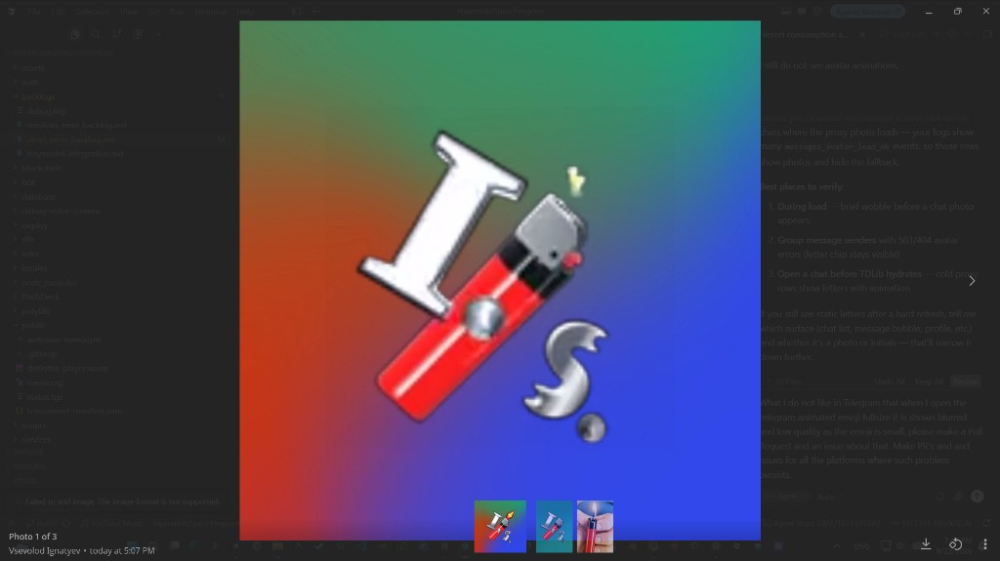

# Telegram: fullscreen / enlarged animated emoji is blurry

## Summary

When opening a Telegram **animated / custom emoji** in the full-size media viewer, Telegram often shows a **low-resolution raster thumbnail** scaled up. The result looks blurry and pixelated, even though the emoji itself is vector/Lottie (`.tgs`) or has a higher-quality asset available.

This is a **Telegram client UX/rendering issue**, not a Hyperlinks Space Program bug. We are tracking it here and reporting it upstream for every official open-source client that accepts GitHub issues.

## Expected

Opening an animated/custom emoji full-size should either:

1. Play the **full Lottie / `.tgs` animation** at a crisp large size, or
2. Show a **high-resolution still** (or retina-scale preview) instead of upscaling the small inline thumbnail.

## Actual

The media viewer enlarges the **small inline preview** (often ~100×100 or similar). Edges become jagged and the image looks soft/blurry.

## Evidence

Observed on Telegram Desktop (Windows): media viewer titled like a photo (“Photo 1 of 3”), showing a custom emoji pack asset at full size with visible pixelation.

## Platforms

| Platform | Upstream issue | Notes |
|----------|----------------|-------|
| Desktop (Windows / Linux / macOS) | [tdesktop#31158](https://github.com/telegramdesktop/tdesktop/issues/31158) | Primary repro in screenshot |
| iOS | [Telegram-iOS#2296](https://github.com/TelegramMessenger/Telegram-iOS/issues/2296) | Related: large emoji Retina blur ([#2292](https://github.com/TelegramMessenger/Telegram-iOS/issues/2292)) |
| Android | — | [DrKLO/Telegram](https://github.com/DrKLO/Telegram) has **GitHub Issues disabled** — report via in-app / Telegram support |
| Telegram Web K | [telegram-tt#538](https://github.com/Ajaxy/telegram-tt/issues/538) | Same media-viewer thumbnail-upscale report |
| Telegram Web A | [tweb#701](https://github.com/morethanwords/tweb/issues/701) | Same media-viewer thumbnail-upscale report |

Hyperlinks Space tracking: [#92](https://github.com/HyperlinksSpace/HyperlinksSpaceProgram/issues/92)

## Suggested fix (for client engineers)

When the user opens an animated/custom emoji in the media viewer:

- Prefer the **document / Lottie animation** (or largest available preview) over the **inline emoji cache thumbnail**.
- On HiDPI screens, request / paint **2× (or devicePixelRatio) sized** previews so upscaling is not required.
- Do not treat custom emoji open-in-viewer as a generic photo open that sticks to the smallest cached bitmap.

## Hyperlinks Space

Filed from [HyperlinksSpace](https://github.com/HyperlinksSpace) / [HyperlinksSpaceProgram](https://github.com/HyperlinksSpace/HyperlinksSpaceProgram) so our Telegram messaging UX work can link official client bugs.

Client forks (for future fix PRs): [`tdesktop`](https://github.com/HyperlinksSpace/tdesktop), [`Telegram-iOS-1`](https://github.com/HyperlinksSpace/Telegram-iOS-1), [`telegram-tt`](https://github.com/HyperlinksSpace/telegram-tt), [`tweb`](https://github.com/HyperlinksSpace/tweb).
