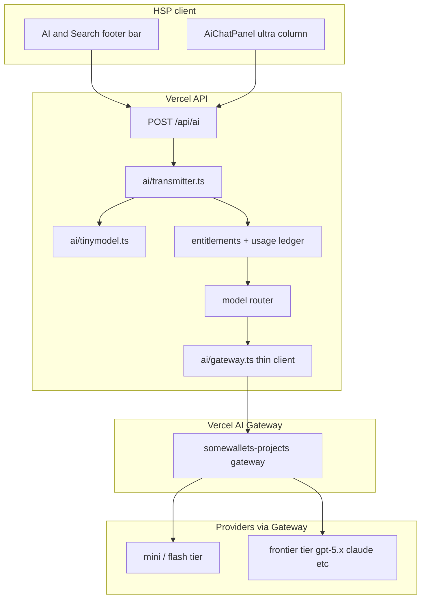

# AI column: Vercel AI Gateway integration & AI Transmitter revenue model

This document covers (1) routing HSP’s AI column through [Vercel AI Gateway](https://vercel.com/docs/ai-gateway) on the **somewallets-projects** team, and (2) a structured revenue / entitlement model for **`ai/transmitter.ts`** — including how to combine TinyModel, freemium trials, and smart model routing.

**Related:** [`responsive-main-right-ai-layout.md`](responsive-main-right-ai-layout.md) (ultra layout AI panel), [`ai_and_search_bar_input.md`](ai_and_search_bar_input.md) (footer prompt bar), [`ai_bot_messages.md`](ai_bot_messages.md) (persistence + thread context), [`../backlogs/tinymodel-integration.md`](../backlogs/tinymodel-integration.md), [`bring-your-own-data-platform-strategy.md`](bring-your-own-data-platform-strategy.md) §3.3 (AI column purpose), [`tdlib-build-your-own-telegram-messages-and-token-analytics.md`](tdlib-build-your-own-telegram-messages-and-token-analytics.md) §3.3.

**Dashboard:** [somewallets-projects AI Gateway](https://vercel.com/somewallets-projects/~/ai-gateway?utm_source=gateway-overview-page&utm_campaign=ai-gateway-overview)

---

## 1) What the AI column is today

| Layer | Role today |
|-------|------------|
| **UI** | `AiChatPanel` (ultra right column), `AiSearchColumnEmptyState` + footer bar (`GlobalBottomBar`) |
| **API** | `POST /api/ai` → `ai/transmitter.ts` |
| **Transmitter** | Thread claim/history, TinyModel RAG (`ai/tinymodel.ts`), then **direct OpenAI** (`ai/openai.ts`, model `gpt-5.2`) |
| **Persistence** | `messages` table when `threadContext` is set (bot + app) |

The AI column is **not** a separate product — it is the same transmitter stack as the bot, with `type: 'app'` and optional `screenRoute` for navigate actions.

---

## 2) Why Vercel AI Gateway fits HSP

HSP already ships the web API on Vercel. AI Gateway sits between **`ai/openai.ts`** and frontier providers:

| Need | Gateway capability |
|------|-------------------|
| One integration for many models | Single endpoint; switch model with a string ([models docs](https://vercel.com/docs/ai-gateway/models-and-providers)) |
| Failover when OpenAI/Anthropic blips | Automatic retries / fallbacks ([provider options](https://vercel.com/docs/ai-gateway)) |
| **Per-user spend** (required for monetization) | Request tags, per-key budgets, per-user quotas ([overview](https://vercel.com/ai-gateway)) |
| No platform markup on tokens | List price from provider; optional BYOK |
| Observability | Dashboard + Reporting API for tokens, latency, cost by tag |
| Low migration cost | Point OpenAI SDK at Gateway base URL — same `responses.create` / stream shape |

Gateway adds ~&lt;20 ms routing latency — acceptable for chat, not for sub-100 ms autocomplete (keep TinyModel local for that).

**What Gateway does *not* replace:** TinyModel classify/retrieve/RAG, thread DB, intent `actions[]`, or entitlement logic — those stay in **AI Transmitter**.

---

## 3) Target architecture (AI column + Gateway)



### 3.1 Code touchpoints (planned)

| File | Change |
|------|--------|
| `ai/openai.ts` | Replace direct `OpenAI({ apiKey })` with Gateway base URL + `AI_GATEWAY_API_KEY` (or OIDC on Vercel) |
| `ai/gateway.ts` (new) | Model IDs, provider options, fallbacks, request tags (`userId`, `feature`, `tier`) |
| `ai/transmitter.ts` | Entitlement gate + **model router** before any paid call |
| `api/_handlers/ai.ts` | Pass `userId`, `plan`, `feature: 'ai_column'` |
| DB (new tables) | `ai_usage_events`, `ai_entitlements` (or columns on `users`) |

### 3.2 Environment variables

| Variable | Purpose |
|----------|---------|
| `AI_GATEWAY_API_KEY` | Vercel AI Gateway key (team: somewallets-projects) |
| `AI_GATEWAY_BASE_URL` | Default `https://ai-gateway.vercel.sh/v1` (confirm in dashboard) |
| `OPENAI` | Retire for app traffic once Gateway is live; keep BYOK only if needed |
| `TINYMODEL_API_URL` | Unchanged — free/local tier |

### 3.3 Request tagging (billing attribution)

Every Gateway call should include tags, e.g.:

- `user_id` — Telegram username or internal id  
- `feature` — `ai_column` \| `bot` \| `token_info`  
- `tier` — `free_tinymodel` \| `freemium` \| `paid`  
- `route` — TinyModel route hint (`navigate`, `token`, `chat`, …)  
- `model` — resolved model id  

This maps Gateway spend → HSP revenue lines and abuse detection.

---

## 4) Revenue model options (your four ideas, structured)

### Option A — Free TinyModel only; all frontier models paid

| Pros | Cons |
|------|------|
| Clear cost boundary; TinyModel already integrated | Users may feel “AI is paywalled” if TinyModel answers feel weak |
| Zero marginal cost on free tier | Need crisp UX: “Upgrade for full answer” |
| Aligns with BYOD (cheap routing/RAG on your side) | Token-info and long context still need frontier |

**Best for:** power users who understand tiers; long-term margin control.

---

### Option B — Several free full-AI tries, then payment

| Pros | Cons |
|------|------|
| Strong onboarding; users feel product value before pay | Must define fair limits (messages vs. tokens vs. days) |
| Industry-standard freemium | Risk of multi-account abuse without identity |
| Pairs well with Gateway per-user quotas | “Try count” UX must be visible in AI column |

**Best for:** growth and conversion; default for consumer TMA.

---

### Option C — Payment from the very beginning

| Pros | Cons |
|------|------|
| Simple accounting; no free-rider problem | High friction; hurts Telegram viral loops |
| Predictable COGS | Hard to demo in investor/partner flows |
| | Competes with free ChatGPT in users’ pockets |

**Best for:** B2B seats, API keys, or white-label — **not** default for main AI column.

---

### Option D — Smart routing between models (AI Transmitter tuning)

| Pros | Cons |
|------|------|
| Lowest COGS per satisfied user | Requires routing policy + quality monitoring |
| Can feel “unlimited” on lower tier | Wrong routing = bad answers or hidden cost spikes |
| Complements A and B (not a substitute) | Needs eval set (TinyModel golden prompts + HSP prompts) |

**Best for:** always-on — this is **infrastructure inside Transmitter**, not a pricing plan by itself.

---

## 5) Recommended config: **hybrid “Smart Freemium”** (A + B + D)

Use **Option C only** for enterprise / API SKU. For the main AI column, ship this:

### 5.1 Tiers

| Tier | Name | What runs | User sees |
|------|------|-----------|-----------|
| **0** | TinyModel | Classify + retrieve + template/RAG answer; **no Gateway call** | Instant reply; badge “Quick answer” |
| **1** | Freemium frontier | **N full turns / calendar month** (suggest **15–25** messages or **~50k tokens**) | Counter in AI column: “12 full AI replies left” |
| **2** | Paid | Higher quota or unlimited fair-use | Subscription / Stars / in-app purchase |
| **3** | Enterprise | BYOK through Gateway + seat billing | Custom |

**Default N:** start with **20 full AI messages / month** per linked account (tune from Gateway dashboard after 2 weeks of data).

### 5.2 Routing policy (Transmitter “smart switch”)

After TinyModel `classify` + optional `retrieve`:

```
1. If route in { navigate, open_screen } and confidence high
     → actions[] only, no LLM (free)

2. If route == token_info and Swap.Coffee facts suffice
     → optional small model (mini) for one paragraph (counts as ½ turn)

3. If route == chat and retrieve hits strong
     → TinyModel-only answer (tier 0)

4. If user asks for analysis, multi-step, code, long context, or low retrieve score
     → require tier 1+ credit → pick model:
         - simple / short → gateway:mini (e.g. gpt-4o-mini class)
         - complex / tool / long → gateway:frontier (gpt-5.x / claude sonnet)
         - on failure → fallback chain in Gateway provider options

5. If tier 1 exhausted and not paid
     → TinyModel best-effort + CTA “Unlock full AI”
```

This implements **your option 4** inside Transmitter while **option 1** defines the free floor and **option 2** defines conversion.

### 5.3 What counts as a “full AI try”

| Counts as 1 turn | Does not count |
|------------------|----------------|
| Any Gateway frontier/mini completion in `chat` or `token_info` | TinyModel-only reply |
| Streamed bot reply that used Gateway | Navigate `actions[]` only |
| Regenerate / edit-resend | Failed request before tokens billed |

Store **token usage** from Gateway response on every billed call for reconciliation.

### 5.4 Pricing shape (placeholder — set from real COGS)

| Plan | Price hint | Quota |
|------|------------|-------|
| Free | $0 | Tier 0 unlimited + Tier 1 **20 msgs/mo** |
| Plus | TBD (e.g. $4.99/mo or Telegram Stars pack) | Tier 1 **500 msgs/mo** or 2M tokens |
| Pro | TBD | Unlimited fair-use + priority model |

Run COGS: average tokens × Gateway price per model mix × 1.3 safety margin.

---

## 6) AI column UX tied to the model

| State | AI column behavior |
|-------|-------------------|
| Empty | Existing prompts (“What tokens are people talking about today?”) |
| Tier 0 reply | Subtle label: quick answer via on-device/sidecar brain |
| Tier 1 active | No label; full streaming |
| Tier 1 low | Footer hint: “3 full AI replies left this month” |
| Tier 1 exhausted | Panel explains limit; button to upgrade; still allow TinyModel |
| Paid | Hide counter; optional model picker in AI options page (backlog) |

Footer bar and ultra panel **share one transmitter** — same entitlements.

---

## 7) Implementation plan

### Phase 0 — Gateway wiring (1–2 days)

- [ ] Create AI Gateway API key on somewallets-projects; set `AI_GATEWAY_API_KEY` in Vercel env  
- [ ] Add `ai/gateway.ts`: OpenAI client with `baseURL` + key  
- [ ] Feature-flag `USE_AI_GATEWAY=1`; shadow-compare latency vs direct OpenAI  
- [ ] Tag all requests: `feature=ai_column|bot`, `user_id`  

**Exit:** `POST /api/ai` and bot both work through Gateway with no user-visible change.

### Phase 1 — Usage ledger (2–3 days)

- [ ] Migration: `ai_usage_events` (user, feature, model, prompt_tokens, completion_tokens, tier, created_at)  
- [ ] Transmitter writes row after each Gateway call  
- [ ] `GET /api/ai/usage` for client counter (or embed in `POST /api/ai` meta)  

**Exit:** Dashboard in Vercel matches internal ledger within ~5%.

### Phase 2 — Entitlements + freemium (3–5 days)

- [ ] Migration: `ai_entitlements` or extend `users` (plan, period_start, messages_used)  
- [ ] `checkAiEntitlement(user)` in transmitter before Gateway  
- [ ] Exhausted → TinyModel fallback + structured `upgrade_required` in response  
- [ ] AI column UI: counter + paywall CTA  

**Exit:** Option B live with N=20/month.

### Phase 3 — Smart router (3–5 days)

- [ ] `resolveModel(request, tinymodelMeta, entitlement)` in transmitter  
- [ ] Rules from §5.2; config in `ai/modelRouter.ts`  
- [ ] Gateway fallbacks for primary model outages  
- [ ] Log `route` + `model` + outcome for tuning  

**Exit:** Option D live; COGS per active user drops vs “always gpt-5.2”.

### Phase 4 — Monetization hook (parallel / after Phase 2)

- [ ] Payment provider (Telegram Stars, Stripe, or wallet) → sets `plan=paid`  
- [ ] Webhook renews period + resets quota  
- [ ] Optional: BYOK for enterprise (Gateway BYOK, zero markup)  

**Exit:** Paid tier unlocks without deploy.

### Phase 5 — Quality & abuse (ongoing)

- [ ] Golden prompts: TinyModel repo + HSP-specific eval in CI  
- [ ] Rate limit per `user_id` + per IP on `/api/ai`  
- [ ] Alert when Gateway daily spend &gt; threshold  

---

## 8) Decision summary

| Your idea | Verdict in HSP |
|-----------|----------------|
| 1. Free TinyModel, paid models | **Yes** — tier 0 floor |
| 2. Several free full-AI tries | **Yes** — tier 1 freemium (default onboarding) |
| 3. Pay from day one | **No** for main column; optional B2B SKU only |
| 4. Smart model switching | **Yes** — core Transmitter router + Gateway fallbacks |

**Perfect config:** **Smart Freemium** — unlimited TinyModel + monthly frontier quota + intelligent Gateway routing + paid upgrade. Gateway on Vercel provides billing observability; Transmitter owns product logic and margin.

---

## 9) Open questions

1. **Identity for quota:** Telegram username only, or email/OIDC subject when linked?  
2. **Bot vs column:** shared quota or separate pools? (Recommend **shared** per user.)  
3. **Token-info mode:** always mini model, or full frontier for “deep dive”?  
4. **Stars vs subscription:** align with Telegram TMA payments when available.  

Resolve in Phase 2 before public paywall copy.
