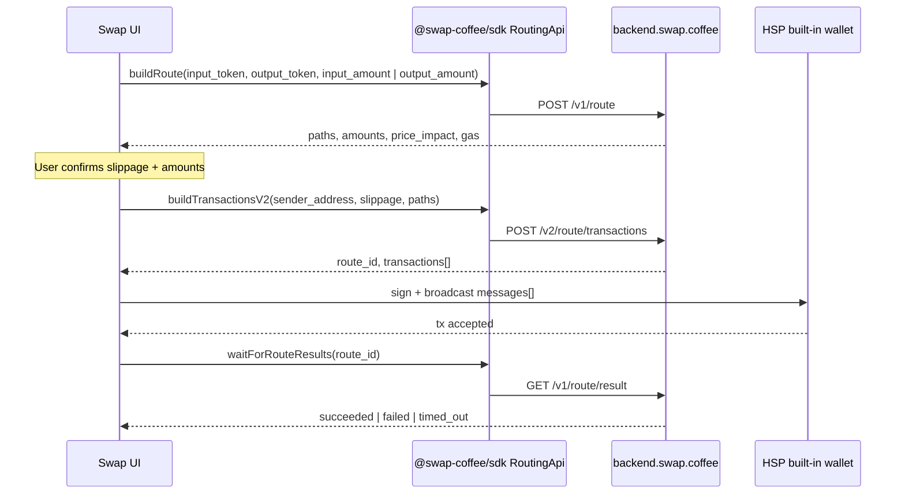

# Swap.Coffee integration — built-in wallet (HSP)

How to wire **real on-chain swaps** through [Swap.Coffee](https://docs.swap.coffee/eng/user-guides/welcome) in **Hyperlinks Space Program**, using the same aggregator flow as [HyperlinksSpace/whatswap](https://github.com/HyperlinksSpace/whatswap), but signing with the **app’s own TON wallet** instead of **TonConnect**.

**Related docs:**

- [`account-and-wallets-mechanics.md`](account-and-wallets-mechanics.md) — account vs wallet rows
- [`wallet-implementation-roadmap-and-login-alignment.md`](wallet-implementation-roadmap-and-login-alignment.md) — envelope + KMS storage
- [`final-security-model.md`](final-security-model.md) — who may see plaintext keys
- [`dllr-dedust-ton-pool-liquidity-and-multichain.md`](dllr-dedust-ton-pool-liquidity-and-multichain.md) — DeDust LP (separate from aggregator swaps)

**External references:**

- [Swap.Coffee Aggregator API — introduction](https://docs.swap.coffee/technical-guides/aggregator-api/introduction.md)
- [Routing (quote → transactions → broadcast)](https://docs.swap.coffee/technical-guides/aggregator-api/routing.md)
- [Supported blockchains (`GET /v1/blockchains`)](https://docs.swap.coffee/technical-guides/aggregator-api-openapi/entity/get-supported-blockchains-currently-only-ton-is-supported.md) — today only **`ton`**
- [Tokens API](https://docs.swap.coffee/technical-guides/tokens-api/introduction.md)
- [OpenAPI spec](https://backend.swap.coffee/openapi)
- [What Swap reference app](https://github.com/HyperlinksSpace/whatswap) — quote + execute via TonConnect

---

## 1) Executive summary

| Question | Answer |
|----------|--------|
| What does Swap.Coffee do for us? | Finds the best **TON DEX route** (DeDust, STON.fi, Coffee DEX, …), returns **pre-built wallet messages**, and tracks execution via `route_id`. |
| What does whatswap already prove? | Full client flow: **`buildRoute` → `buildTransactionsV2` → wallet sends messages → `waitForRouteResults`**. |
| What does HSP have today? | **Quotes + charts + jetton catalog** (`ui/swap/`, `blockchain/coffee.ts`). **No swap execution.** Wallet **creation + encrypted storage** exists; **sign/broadcast** does not. |
| Main difference from whatswap? | whatswap calls **`tonConnectUI.sendTransaction`**. HSP must call **`WalletContractV4.sendTransfer`** (or server vault signing) with the same message list. |
| Which API host? | Routing: **`https://backend.swap.coffee`** (whatswap + `ui/swap/fetchSwapAmount.ts`). Tokens: **`https://tokens.swap.coffee`**. Note: `blockchain/coffee.ts` defaults to `api.swap.coffee` — align env to **`backend.swap.coffee`** for routing. |

---

## 2) Swap.Coffee API surface (what you actually call)

### 2.1 Blockchains

Only TON is supported today:

```http
GET https://backend.swap.coffee/v1/blockchains
→ [{ "name": "ton" }]
```

Every token reference uses `{ blockchain: "ton", address: "native" | "<jetton_master>" }`.

### 2.2 Two backends

| Host | Role in HSP |
|------|-------------|
| **`backend.swap.coffee`** | Aggregator: routes, transaction building, route results, TON wallet balance helpers |
| **`tokens.swap.coffee`** | Jetton metadata, search, OHLCV charts, account jetton balances (`/api/v3/...`) |

Optional header: **`X-Api-Key`** (from [Swap.Coffee partner form](https://swapcoffee.typeform.com/to/Zx49Ho3y)). Public routing works without a key; keys help rate limits and partner features.

### 2.3 Routing flow (same as official docs)



**Amounts in route requests are human token units** (e.g. `5` TON, not nanotons). Transaction **`value`** fields are **nanotons** (strings).

### 2.4 Transaction message shape (from Swap.Coffee → wallet)

Each entry in `transactions.data.transactions`:

| Field | Meaning | Maps to `@ton/ton` |
|-------|---------|-------------------|
| `address` | Destination contract | `internal({ to: Address.parse(address) })` |
| `value` | Nanotons (string) | `value: BigInt(value)` |
| `cell` | Base64 BOC body | `body: Cell.fromBoc(Buffer.from(cell, "base64"))[0]` |
| `stateInit` | Optional deploy (base64) | `init` on internal message if present |
| `send_mode` | TON send mode | Usually default; respect if non-zero |

whatswap maps these 1:1 into TonConnect:

```typescript
messages = transactions.data.transactions.map((tx) => ({
  address: tx.address,
  amount: tx.value,
  payload: tx.cell,
}));
await tonConnectUI.sendTransaction({ validUntil, messages });
```

HSP replaces only the last step (see §5).

---

## 3) What whatswap does (reference integration)

Key files in [HyperlinksSpace/whatswap](https://github.com/HyperlinksSpace/whatswap):

| File | Responsibility |
|------|----------------|
| `src/hooks/use-swap-calculation.ts` | Live quotes: **`RoutingApi.buildRoute`** with `input_amount` (ExactIn) or `output_amount` (ExactOut); debounced for TMA keyboard UX |
| `src/lib/swap-service.ts` | **`buildRoute` → `buildTransactionsV2` → TonConnect `sendTransaction` → `waitForRouteResults`** |
| `src/hooks/use-swap-execution.ts` | Connects wallet address + TonConnect UI to `swapService.executeSwap` |
| `src/lib/swap-coffee-api.ts` | Proxied **`tokens.swap.coffee/api/v3`** (jetton list, search) |
| `src/components/Root/Root.tsx` | **`TonConnectUIProvider`** + manifest |

**Quote modes (whatswap):**

- **Forward (ExactIn):** user edits “Send” → `buildRoute({ input_amount })` → display “Get” from `output_amount`.
- **Reverse (ExactOut):** user edits “Get” → `buildRoute({ output_amount })` → display “Send” from `input_amount`.

**Execution (whatswap `swap-service.ts`):**

1. `buildRoute({ input_token, output_token, input_amount })`
2. `buildTransactionsV2({ sender_address, slippage: 0.1, paths: route.data.paths })`
3. Map `transactions[]` → TonConnect messages
4. `tonConnectUI.sendTransaction({ validUntil: now + 5min, messages })`
5. `waitForRouteResults(route_id, routingApi)`

**Dependencies:** `@swap-coffee/sdk`, `@tonconnect/ui-react`.

---

## 4) What HSP already has

### 4.1 Swap UI & read-only API (no execution)

| Path | Status |
|------|--------|
| `ui/swap/fetchSwapAmount.ts` | Fixed **USDT → TON** quote via `POST /v1/route/smart` |
| `ui/swap/fetchSwapJettons.ts`, `fetchSwapChart.ts` | Token catalog + charts |
| `ui/swap/useSwapAmount.ts`, `useSwapChart.ts` | React hooks for panel |
| `ui/components/SwapPanelContent.tsx`, `SwapScreen.tsx` | UI shell; **Swap button not wired to chain** |
| `blockchain/coffee.ts` | Server **`RoutingApi`** + token search |
| `api/_handlers/swap-coffee-tokens.ts` | Proxy for Electron `app://` (tokens API) |

### 4.2 Wallet (creation only)

| Path | Status |
|------|--------|
| `services/wallet/tonWallet.ts` | `generateMnemonic`, `deriveAddressFromMnemonic` (**WalletContractV4**), `mnemonicToPrivateKey` available via `@ton/crypto` |
| `services/wallet/walletEnvelopeClient.ts` | Client-side AES envelope before register |
| `api/_handlers/wallet-register.ts` | Persist address + KMS-wrapped mnemonic envelope |
| `HomeAuthenticatedScreen.tsx` | Create-wallet product flow |

**Missing for swaps:** decrypt/unlock path, `TonClient`, `sendTransfer`, balance refresh, swap confirmation sheet.

### 4.3 TonConnect elsewhere (not the main app model)

`dllr/token` and `dllr/wallet` use TonConnect for **contract deploy/demo**. The main HSP product is **internal wallet**, not an external signer.

---

## 5) Built-in wallet vs TonConnect — the only part that changes

Everything through **`buildTransactionsV2`** stays identical to whatswap. Replace **wallet I/O** only.

| Step | whatswap (TonConnect) | HSP (built-in wallet) |
|------|----------------------|------------------------|
| Sender address | `useTonAddress()` from connected wallet | `deriveAddressFromMnemonic` / loaded wallet row `wallet_address` |
| Connect UX | `TonConnectUIProvider`, connect modal | **None** — user already has HSP wallet |
| Sign + send | `tonConnectUI.sendTransaction({ messages })` | `WalletContractV4` + `TonClient.sendTransfer` |
| Network | TonConnect `network` in request | Explicit mainnet/testnet in `TonClient` endpoint |
| Key material | Stays in Tonkeeper / external app | Mnemonic from **unlock flow** (client or vault — see §6) |
| Result polling | `waitForRouteResults` | **Same** — no wallet dependency |
| `max_splits` | Default 4 (V4 wallet limit) | HSP uses **V4** today → keep **`max_splits ≤ 3`** if adding custom fees; else **4** is OK |

### 5.1 Signing adapter (conceptual)

Add something like `services/wallet/tonSwapSend.ts` (name illustrative):

```typescript
import { Cell, Address } from "@ton/core";
import { internal, TonClient, WalletContractV4 } from "@ton/ton";
import { mnemonicToPrivateKey } from "@ton/crypto";
import type { ApiRouteTransaction } from "@swap-coffee/sdk"; // or local type

export async function sendSwapCoffeeTransactions(opts: {
  mnemonic: string[];
  transactions: Array<{
    address: string;
    value: string;
    cell: string;
    stateInit?: string;
  }>;
  endpoint: string; // e.g. Toncenter JSON-RPC
  apiKey?: string;
}): Promise<void> {
  const keyPair = await mnemonicToPrivateKey(opts.mnemonic);
  const wallet = WalletContractV4.create({
    workchain: 0,
    publicKey: keyPair.publicKey,
  });
  const client = new TonClient({
    endpoint: opts.endpoint,
    apiKey: opts.apiKey,
  });
  const contract = client.open(wallet);
  const seqno = await contract.getSeqno();

  const messages = opts.transactions.map((tx) =>
    internal({
      to: Address.parse(tx.address),
      value: BigInt(tx.value),
      body: Cell.fromBoc(Buffer.from(tx.cell, "base64"))[0]!,
      // if tx.stateInit: parse and pass init:
    }),
  );

  await contract.sendTransfer({
    seqno,
    secretKey: keyPair.secretKey,
    messages,
  });
}
```

**Notes:**

- Swap.Coffee may return **multiple** internal messages in one wallet transfer — same as TonConnect’s multi-message `sendTransaction`.
- Respect **`max_splits`**: V4 supports up to **4** outbound messages per transfer; if you add **`custom_fee`**, reserve one slot (`max_splits: 3` in `buildRoute`).
- Poll **`waitForRouteResults(route_id)`** after broadcast; handle `failed` / `timed_out` / stuck-on-intermediate-token cases per [routing docs](https://docs.swap.coffee/technical-guides/aggregator-api/routing.md).

### 5.2 Swap service shape (mirror whatswap)

Suggested modules:

```
services/swap/
  swapCoffeeClient.ts      # RoutingApi singleton, basePath: backend.swap.coffee
  swapCoffeeTokens.ts      # thin wrapper over existing ui/swap/fetchSwapJettons
  executeSwap.ts           # buildRoute → buildTransactionsV2 → sendSwapCoffeeTransactions → waitForRouteResults

ui/swap/
  useSwapQuote.ts            # port whatswap use-swap-calculation (both directions)
  useSwapExecution.ts        # calls executeSwap with unlocked mnemonic ref
```

`executeSwap` signature (no TonConnect):

```typescript
export async function executeSwap(params: {
  fromToken: SwapToken;
  toToken: SwapToken;
  fromAmount: string;
  slippage: number;
  senderAddress: string;
  mnemonic: string[]; // from unlock flow — never log, never send to analytics
}): Promise<{ success: boolean; routeId?: string; error?: string }>;
```

---

## 6) Where the mnemonic comes from (HSP-specific)

whatswap never sees the seed — TonConnect does. HSP must define **one** unlock path before swaps:

| Model | Flow | Fits |
|-------|------|------|
| **A — Client unlock (preferred for non-custodial)** | User enters passphrase / biometrics → decrypt envelope **in app** → hold mnemonic in memory for session → sign locally → discard | [`final-security-model.md`](final-security-model.md) hybrid variant |
| **B — Server vault (custodial)** | Authenticated API → KMS unwrap DEK → decrypt envelope server-side → sign on server → broadcast | Stricter ops burden; already partially probed in `wallet-envelope-verify` |

**Do not** send mnemonic to Swap.Coffee or log it in `messages_scroll_action`-style debug channels.

Minimum product UX:

1. First swap (or settings): **unlock wallet** once per session.
2. Confirmation sheet: from/to tokens, amounts, **price impact**, **slippage**, estimated gas (`recommended_gas` from route).
3. On success: refresh jetton balances (`tokens.swap.coffee` account endpoint or on-chain).
4. On `failed` / intermediate token: show Swap.Coffee result steps, link to [routing status docs](https://docs.swap.coffee/technical-guides/aggregator-api/routing.md).

---

## 7) Implementation checklist (HSP)

### Phase 1 — Parity with whatswap quotes

- [ ] Add `@swap-coffee/sdk` to root `package.json` (if not already).
- [ ] Set **`COFFEE_BASE_URL=https://backend.swap.coffee`** in `.env` (fix `blockchain/coffee.ts` default).
- [ ] Implement `useSwapQuote` — port forward/reverse logic from whatswap `use-swap-calculation.ts`.
- [ ] Wire **Send / Get** fields in `SwapPanelContent` to live routes (replace fixed `fetchSwapAmount` only path).
- [ ] Token picker: reuse `ui/swap/fetchSwapJettons.ts` + `useChooseCurrencyRows`.

### Phase 2 — Execution with built-in wallet

- [ ] Implement **`sendSwapCoffeeTransactions`** (`@ton/ton` + `@ton/core`).
- [ ] Implement **`executeSwap`** (mirror `whatswap/src/lib/swap-service.ts`, drop TonConnect).
- [ ] Wallet unlock gate before `executeSwap`.
- [ ] Connect **`SwapActionRow`** (or equivalent) to `useSwapExecution`.
- [ ] Post-swap: `waitForRouteResults` + UI states (pending / success / failed).
- [ ] Refresh balances in wallet home after terminal status.

### Phase 3 — Production hardening

- [ ] **Slippage** control (user setting; default lower than whatswap’s 10% unless product says otherwise).
- [ ] **`max_splits`** tuned for V4; document upgrade path to W5 (`dllr/wallet`) for >4 splits.
- [ ] Rate limits + optional **`X-Api-Key`** on server proxy if web/Electron CORS requires it.
- [ ] Referral / **`custom_fee`** only after partner approval ([routing — custom fees](https://docs.swap.coffee/technical-guides/aggregator-api/routing.md)).
- [ ] Telemetry: log `route_id`, statuses — **never** cells, mnemonics, or full payloads in production logs.

---

## 8) Environment variables

| Variable | Where | Purpose |
|----------|-------|---------|
| `COFFEE` | Server | `X-Api-Key` for aggregator + tokens proxy |
| `COFFEE_BASE_URL` | Server | **`https://backend.swap.coffee`** |
| `COFFEE_TOKENS_BASE_URL` | Server | `https://tokens.swap.coffee` |
| `EXPO_PUBLIC_COFFEE` | Client | Optional tokens API key |
| `EXPO_PUBLIC_COFFEE_TOKENS_BASE_URL` | Client | Tokens host |
| `EXPO_PUBLIC_TON_RPC_URL` | Client | Toncenter / own node for `TonClient` |
| `EXPO_PUBLIC_TON_RPC_KEY` | Client | JSON-RPC API key if required |

---

## 9) Mapping whatswap → HSP files

| whatswap | HSP (existing or new) |
|----------|------------------------|
| `use-swap-calculation.ts` | **New** `ui/swap/useSwapQuote.ts` |
| `swap-service.ts` | **New** `services/swap/executeSwap.ts` |
| `use-swap-execution.ts` | **New** `ui/swap/useSwapExecution.ts` |
| `swap-coffee-api.ts` | `ui/swap/fetchSwapJettons.ts` + `api/_handlers/swap-coffee-tokens.ts` |
| `TonConnectUIProvider` | **Remove** — use `services/wallet/tonWallet.ts` + unlock |
| `full-tc-button.tsx` | Wallet balance row in existing home / swap header |
| `public/tonconnect-manifest.json` | **Not needed** for built-in wallet |

---

## 10) Differences to keep in mind

1. **HSP is the wallet** — no connect/disconnect lifecycle; instead **unlock + session TTL**.
2. **Wallet version** — production wallets are **V4** (`tonWallet.ts`); respect 4-message limit. whatswap’s default `max_splits: 4` is fine without custom fees.
3. **Smart route vs full SDK** — `fetchSwapAmount.ts` uses `/v1/route/smart` for a demo USDT→TON line; full swap UI should use **`buildRoute` / `buildTransactionsV2`** like whatswap for arbitrary pairs.
4. **Electron / TMA** — tokens API may need the existing **Vercel proxy** (`swap-coffee-tokens` handler) when `fetch` from `app://` is restricted; routing can follow the same pattern if needed.
5. **Security** — signing code belongs next to wallet services; Swap.Coffee only ever receives **public** `sender_address` and route params.

---

## 11) Minimal end-to-end pseudocode (built-in wallet)

```typescript
import { RoutingApi, waitForRouteResults } from "@swap-coffee/sdk";
import { sendSwapCoffeeTransactions } from "@/services/wallet/tonSwapSend";

const routingApi = new RoutingApi(); // defaults to backend.swap.coffee

async function swapTonToJetton(mnemonic: string[], walletAddress: string) {
  const route = await routingApi.buildRoute({
    input_token: { blockchain: "ton", address: "native" },
    output_token: { blockchain: "ton", address: "EQ…jetton" },
    input_amount: 1.0,
    max_splits: 4,
  });

  const txs = await routingApi.buildTransactionsV2({
    sender_address: walletAddress,
    slippage: 0.05,
    paths: route.data.paths,
  });

  await sendSwapCoffeeTransactions({
    mnemonic,
    transactions: txs.data.transactions,
    endpoint: process.env.EXPO_PUBLIC_TON_RPC_URL!,
  });

  const results = await waitForRouteResults(txs.data.route_id, routingApi);
  return results;
}
```

Compare to [official routing sample](https://docs.swap.coffee/technical-guides/aggregator-api/routing.md): replace `connector.sendTransaction` with `sendSwapCoffeeTransactions`.

---

## 12) Testing

1. **Testnet first** — `deriveAddressFromMnemonic({ testnet: true })`, testnet RPC, small amounts.
2. **ExactIn and ExactOut** — both quote directions; ExactOut does not support splits.
3. **Multi-hop route** — pick an illiquid jetton to force `A → B → C` and verify result `steps` in UI on failure.
4. **Timeout** — send only after delay to confirm `timed_out` handling (validUntil / user education).
5. **Balance refresh** — account jettons endpoint vs on-chain after success.

---

*Last updated: 2026-07-11 — aligns with Swap.Coffee OpenAPI on `backend.swap.coffee`, whatswap `main`, and HSP wallet code in `services/wallet/tonWallet.ts`.*
